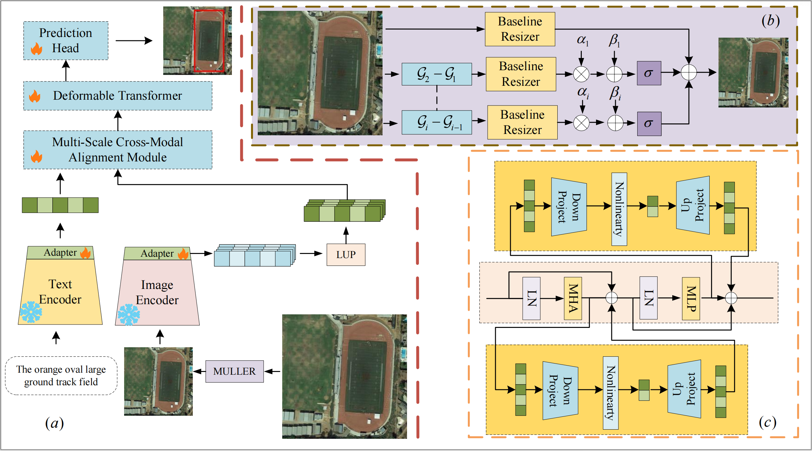

# ReMLVG: A RemoteCLIP-Based Framework for Remote Sensing Visual Grounding

This repository contains the official implementation of **ReMLVG**, a RemoteCLIP-based framework for remote sensing visual grounding (RSVG). Given a remote sensing image and a language expression, ReMLVG localizes the referred target with a bounding box.

ReMLVG adapts the pretrained cross-modal alignment capability of RemoteCLIP to fine-grained remote sensing visual grounding by combining frozen RemoteCLIP encoders, lightweight adapters, multi-level ViT feature construction, and detail-preserving image resizing.

## Highlights

- Adapts RemoteCLIP to fine-grained remote sensing visual grounding.
- Keeps the RemoteCLIP visual and text encoders frozen to preserve pretrained cross-modal priors.
- Introduces lightweight visual and textual adapters for task-specific adaptation.
- Builds multi-level ViT features with the Layer-wise Upsampled Pyramid (LUP).
- Uses MULLER resizing to preserve fine details during large image downsampling.
- Achieves **83.04% cumIoU** on the DIOR-RSVG dataset.

## Framework

Place the framework image at `assets/overall_framework.png`, then it can be displayed in this README as follows:

<p align="center">
  
</p>

The overall pipeline consists of:

1. Detail-preserving image resizing with MULLER.
2. Frozen RemoteCLIP ViT-L/14 visual and text encoders.
3. Lightweight adapters inserted into both visual and textual Transformer blocks.
4. LUP for constructing multi-level visual features from ViT layers `{0, 7, 15, 23}`.
5. Cross-modal fusion and grounding with the downstream MSCMA and Deformable DETR modules.

## Results

### DIOR-RSVG

| Method | Visual Encoder | Text Encoder | Pr@0.5 | Pr@0.6 | Pr@0.7 | Pr@0.8 | Pr@0.9 | meanIoU | cumIoU |
|---|---|---|---:|---:|---:|---:|---:|---:|---:|
| ReMLVG | RemoteCLIP ViT-L/14 | RemoteCLIP Text Encoder | 78.64 | 74.41 | 67.61 | 56.43 | 36.04 | 68.96 | 83.04 |

### RSVG-HR

| Method | Visual Encoder | Text Encoder | Pr@0.5 | Pr@0.6 | Pr@0.7 | Pr@0.8 | Pr@0.9 | meanIoU | cumIoU |
|---|---|---|---:|---:|---:|---:|---:|---:|---:|
| ReMLVG | RemoteCLIP ViT-L/14 | RemoteCLIP Text Encoder | 63.93 | 53.91 | 37.07 | 17.64 | 3.41 | 52.11 | 48.44 |

## Installation

```bash
git clone https://github.com/FoxWe1/ReMLVG.git
cd ReMLVG

conda create -n remlvg python=3.10 -y
conda activate remlvg

pip install -r requirements.txt
```

The exact environment file and dependency versions will be released with the code.

## Dataset Preparation

ReMLVG is evaluated on DIOR-RSVG and RSVG-HR.

An example directory structure is:

```text
data/
  DIOR-RSVG/
    images/
    annotations/
  RSVG-HR/
    images/
    annotations/
```

Please download the datasets from their official sources and update the dataset paths in the configuration files.

## Training

Example commands:

```bash
# Train on DIOR-RSVG
nohup ./train.sh > outputs/logs/dior_rsvg_1.log 2>&1 &

# Fine-tune on RSVG-HR
1. change dataset name and path from train.sh
2. choose pth trained in DIOR-RSVG
3. use the same commands in DIOR-RSVG to fin-tune on RSVG-HR
```

The released code will provide the final training scripts and configuration files.

## Evaluation

```bash
1. GPU_LIST=0,1,2,3,4,5,6,7 OUTPUT_DIR=outputs/dior_rsvg_2 nohup bash one4all.sh > outputs/dior_rsvg_2/one4all.log 2>&1 & (all pth files)
2. bash test.sh (evaluate specific pth file)
```

We report Pr@0.5, Pr@0.6, Pr@0.7, Pr@0.8, Pr@0.9, meanIoU, and cumIoU.

## Visualization

```bash
./visual_multi.sh
```

## Citation

If you find this work useful, please cite:

```bibtex
@unpublished{hu2026remlvg,
  title={ReMLVG: A RemoteCLIP-Based Framework for Remote Sensing Visual Grounding},
  author={Hu, Lingwei and Qu, Zhong},
  note={Under review at Pattern Recognition Letters},
  year={2026}
}
```

## License

The license will be specified when the code is released.
